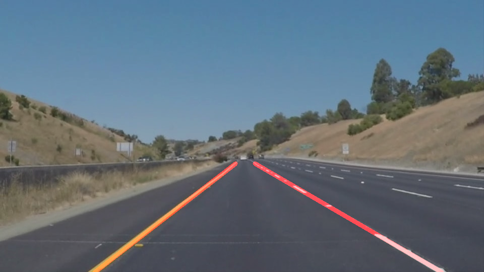
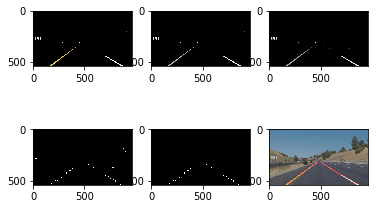
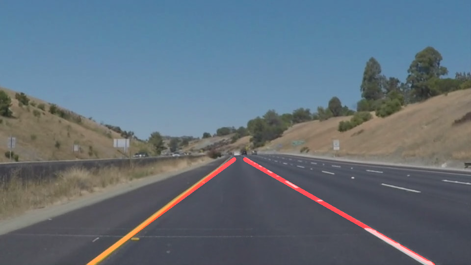

# **Finding Lane Lines on the Road** 

In this project I have used Python3, Numpy, Matplotlib, Canny Edge Detection, Hough Transforms, Linear Regression to mark lane lines on a given road image. I have tried the following three different approaches to extrapolate the lines identified through Hough transform to extend them to the full lane lines in the image. 

1. Extrapolating the lines using mean slopes
2. Extrapolating the lines using mean slopes of biggest lines 
3. Extrapolating the lines using Linear Regression 

I have tried all these three approaches on the sample images and test videos. All these three techniques are working fine on the sample images and videos, but the first two techniques are not working well on the optional challenge and the Linear Regression approach is working fine on the optional challenge.

---

## **Goal of this project**

The goals / steps of this project are the following:
* Make a pipeline that finds lane lines on the road
* Test the pipeline on the sample images and videos
* Write the Lane marked images and Videos to new directory

A sample original image and lane marked image is shown below




---

## **Reflection**

### **How the Pipeline is built**

I have built this pipeline in the following 7 steps

1. Filtering the image to identify white and yellow colours as the lane lines on original image is marked in these two colours
2. Converting the image to gray scale
3. Applying gaussian smoothing with a kernel size of 3 to smoothen this image
4. Detecting the edges using canny edge detection with a low and high gradient threshold of 50 and 150
5. Selecting a region of interest which is in a polygon shape with wide bottom side and narrow top side to darken any pixels outside this polygon.
6. Applying Hough transform on this image to get an array of all identified lines
7. Extrapolate these lines using Linear Regression to draw one continuou lane line each for the left and right lanes

Here is how the image is processed after going through each stage of the above mentioned pipeline


Here are my observations about the three approaches that I used to draw the lines

### **Mean Slopes Approach**

This is the simple and first approach that I wanted to test and try on this problem. Here are the steps at a high level used in this approch
1. Find slopes of all the lines that we get using hough transform (handle any division by 0 with a huge slope)
```
slopes = np.where((lines[:,2] - lines[:,0])==0.,999.,((lines[:,3]-lines[:,1]) / (lines[:,2] - lines[:,0])))
```
2. Divide the image based on the center of x-axis i.e width of the image to decide which lines to consider for left and right lanes
3. As height of the image in pixels starts with 0 at top left corner and reaches a maximum at the bottom left corner, the slope of left lines are considered negative and the slope of right lines are considered positive.
4. Decide a threshold slope to take lines only beyond that threshold to be considered for extrapolation
5. Identify the left lines and right lines based on the above two points and average slopes and average intercepts for left and right lines
```
x_center = img.shape[1] / 2
lines = lines[np.abs(slopes)>0.5]
slopes = slopes[np.abs(slopes)>0.5]
left_lines = lines[slopes<0 & (lines[:,0] < x_center) & (lines[:,2] < x_center)]
right_lines = lines[slopes>0 & (lines[:,0] > x_center) & (lines[:,2] > x_center)] 
right_slopes = slopes[slopes>0]
left_slopes = slopes[slopes<0]
left_mean_slope = np.mean(left_slopes)
right_mean_slope = np.mean(right_slopes)
```
6. Find the starting and ending points of the lines making use of these mean slopes and intercepts and extrapolate the lines

This approach has worked fine for most of the images but is not very robust. As the mean of a dataset is highly influenced by the outliers in the dataset, this approach won't work well all the time. For example see the left lane identified by this approach in the following image 

 

### **Mean slopes of n biggest lines**

After observing the results from the first approach, I thought it would be better if I take only n biggest lines in length and take the mean slopes of them alone and extrapolate the lane lines.

The high level steps used in this approach are similar to the mean slopes approach except that there are these additional steps to calculate the line lengths using sqrt((x2-x1)^2+(y2-y1)^2) and picking the top 5 lines by length

```
left_lines_sizes = np.sqrt((left_lines[:,2]-left_lines[:,0])**2 + (left_lines[:,3]-left_lines[:,1])**2)
right_lines_sizes = np.sqrt((right_lines[:,2]-right_lines[:,0])**2 + (right_lines[:,3]-right_lines[:,1])**2)

left_lines_sizes_sorted = np.argsort(left_lines_sizes)
right_lines_sizes_sorted = np.argsort(right_lines_sizes)

left_mean_slope = left_slopes[left_lines_sizes_sorted][-5::].mean()
right_mean_slope = right_slopes[right_lines_sizes_sorted][-5::].mean()

```
This approach definitely is working well compared to the simple mean slopes approach on both the challenge videos. But when it comes to optional challenge, I could notice that at few frames starting from frame 72 till 80, the right lane is detected incorrectly and it is drawing the line almost in the center of the image between left and right lanes.


### **Using Linear Regression for extrapolating the lines**

Since the Mean slopes of n biggest lines had some places in the optional challenge video that it failed to detect the lane lines properly, I thought it is time to try some more advanced techniques like linear regression to fit this line.

The overall approach is similar to mean slopes, except that we don't calculate any mean of the slopes and intercepts here and we don't remove any outliers. But we use Linear regression to find a best fit given all the x and y co-ordinates of the left and right lines

```
left_m, left_b = np.polyfit(left_lines_x, left_lines_y, 1)
right_m, right_b = np.polyfit(right_lines_x, right_lines_y, 1) 
```

This approach has overcome the issues that I encountered in the second approach (mean by removing outliers) and has worked pretty well on all the challenge videos and the optional challenge video. I think it can be improved further if I use a higher order polynomial fit as the road is curved here in the optional challenge video. 
